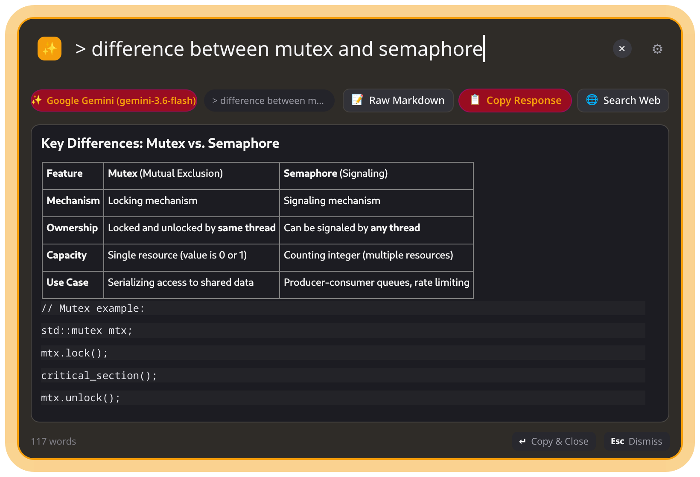
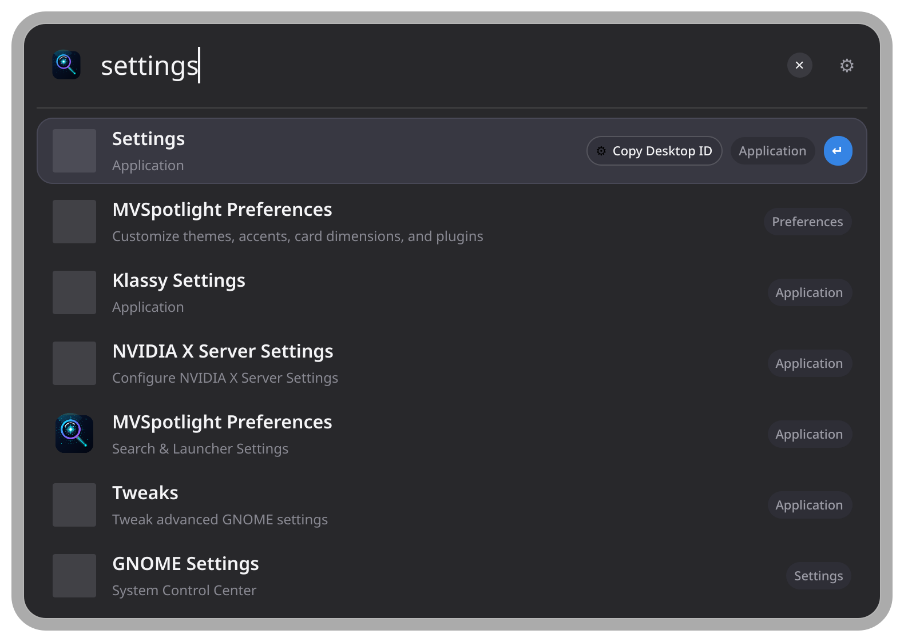
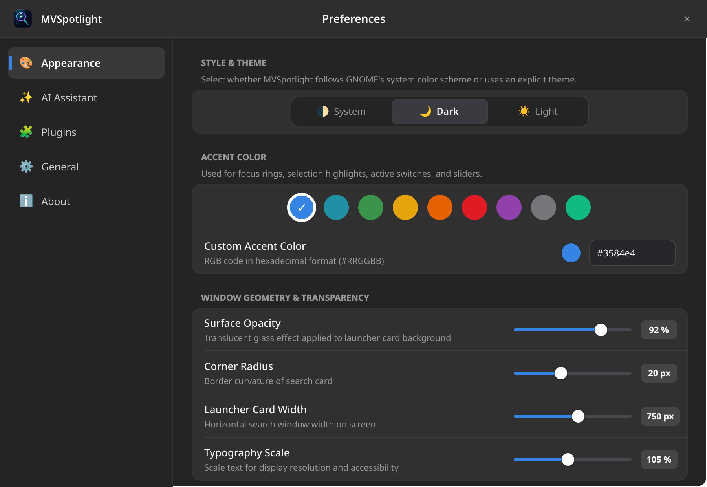
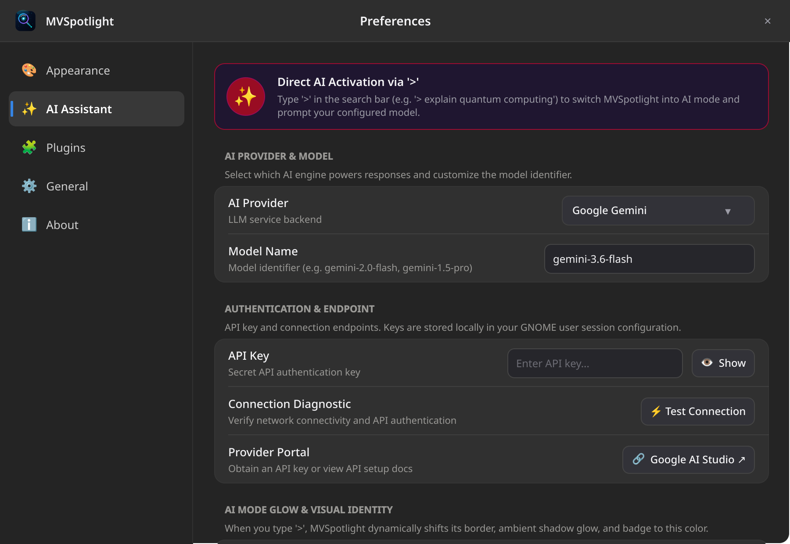
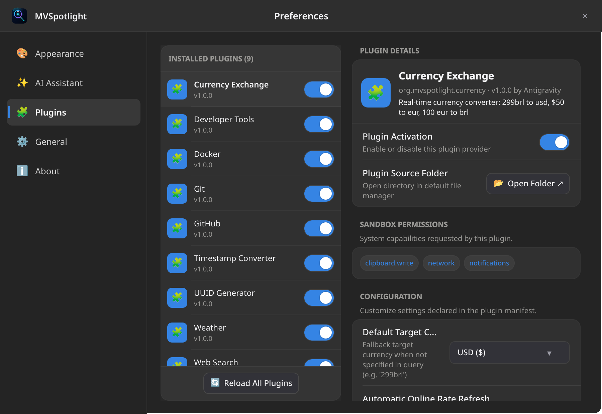
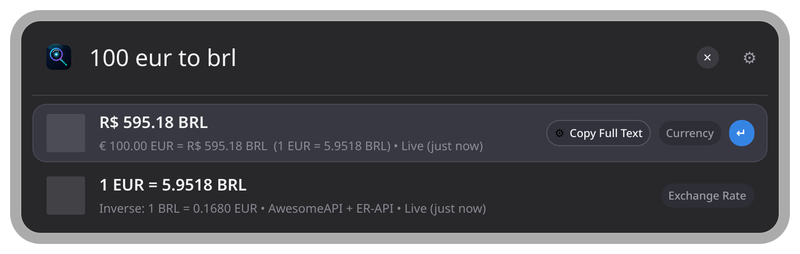
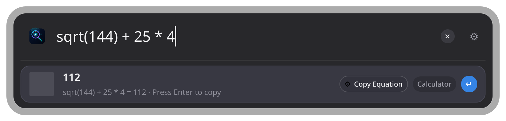

<div align="center">


# MVSpotlight

### macOS Spotlight-Inspired Desktop Launcher & AI Command Palette for GNOME 50 on Wayland

[](https://github.com/marconvcm/MVSpotlight/releases/latest)
[](https://github.com/marconvcm/MVSpotlight/actions)
[](LICENSE)
[](https://www.gnome.org)
[](https://www.qt.io)

<p align="center">
  <b>A keyboard-first desktop launcher, application palette, and inline AI assistant designed from the ground up for modern Linux.</b><br/>
  Zero legacy X11 baggage • Sub-50ms activation • Native Libadwaita styling • Embedded Lua 5.4 runtime
</p>

<br/>



</div>

---

## ⚡ Quick Start & Installation

### Fedora / RHEL (RPM)
```bash
# Download latest RPM from GitHub Releases
curl -LO https://github.com/marconvcm/MVSpotlight/releases/latest/download/mvspotlight-1.0.0-1.fc44.x86_64.rpm
sudo dnf install ./mvspotlight-1.0.0-1.fc44.x86_64.rpm
```

### Debian / Ubuntu (DEB)
```bash
# Download latest DEB from GitHub Releases
curl -LO https://github.com/marconvcm/MVSpotlight/releases/latest/download/mvspotlight-1.0.0-Linux.deb
sudo apt install ./mvspotlight-1.0.0-Linux.deb
```

### Generic Linux (Portable Archive)
```bash
# Download standalone portable package
curl -LO https://github.com/marconvcm/MVSpotlight/releases/latest/download/mvspotlight-1.0.0-Linux.tar.gz
tar -xzf mvspotlight-1.0.0-Linux.tar.gz
./bin/mvspotlight --daemon
```

---

## 🌟 Visual Showcase

<div align="center">

### 🔍 Desktop Search & GNOME Integration
*Instantaneous fuzzy search across installed apps, GNOME Settings, and local files.*



<br/><br/>

### 🤖 Inline Multi-LLM Assistant
*Type `>` followed by your question. Streams syntax-highlighted Markdown directly inside the palette.*


<br/><br/>

### 🎨 Wayland-Native Preferences & Live Customization
*Tailor your glassmorphism opacity, corner radius, and accent colors with real-time feedback.*



<br/><br/>

### ⚙️ Multi-Model AI Engine Settings
*Plug in Google Gemini, OpenAI, Claude, or local offline LLMs via Ollama with connection testing.*



<br/><br/>

### 🧩 Lua 5.4 Plugin Architecture & Schema Controls
*Manage plugins, inspect sandbox permissions, and tweak dynamically rendered settings.*



<br/><br/>

### 💱 Real-Time Currency & Calculator Math
*Instant financial conversions with live inverse rates and safe mathematical expressions.*

<p align="center">
  
  &nbsp;
  
</p>

</div>

---

## 🚀 Key Highlights

| Feature | Description |
|---|---|
| ⚡ **Instantaneous Interaction** | Runs as an ultra-light background daemon; toggles in $<50\text{ms}$ upon pressing `Alt + Space`. |
| 🪟 **Frameless Floating Panel** | macOS Spotlight-inspired floating card with soft drop shadows, subtle borders, and dynamic animated height. |
| 🤖 **Inline AI Assistant** | Instant answers via `>` prefix. Supports **Google Gemini**, **OpenAI**, **Anthropic Claude**, and local **Ollama** models. |
| 🖥️ **Wayland Native & Multi-Monitor** | Follows the active mouse pointer or focused display window at $26\%$ from display top. Zero X11 dependencies. |
| 🎨 **Adaptive Theme Engine** | Tracks GNOME color scheme preferences in real-time (`dark` / `light`) with 9 vibrant Adwaita accent palettes. |
| 🔍 **Frecency Ranking Pipeline** | Exact, prefix, substring, and fuzzy matching weighted by usage frecency (`~/.local/state/mvspotlight/history.json`). |
| 🧩 **Sandboxed Lua Plugins** | Hot-reloading Lua 5.4 plugins with watchdog timers and declarative permissions (`network`, `clipboard.write`). |

---

## ⌨️ Keyboard Controls Cheatsheet

| Shortcut | Context | Action |
|---|---|---|
| `Alt + Space` | Global | Toggle MVSpotlight launcher visibility |
| `Ctrl + ,` | Launcher | Open Preferences Window |
| `>` or `> <prompt>` | Search Bar | Activate AI Assistant chat mode |
| `Down` / `Tab` | Search Results | Navigate to next item |
| `Up` / `Shift + Tab` | Search Results | Navigate to previous item |
| `Enter` | Search Results | Execute primary action / Submit AI prompt |
| `Ctrl + Enter` | Search Results | Execute secondary action (Copy ID, reveal in Files) |
| `Esc` | Launcher / AI | Clear query, return from AI response, or dismiss |
| `:settings` / `preferences` | Search Bar | Open Preferences directly from query |
| `:plugins` | Search Bar | Open Plugin Management |
| `:reload` | Search Bar | Hot-reload all Lua plugins from disk |
| `:theme` | Search Bar | Toggle dark / light color scheme |

---

## 📦 Bundled Lua Plugins

MVSpotlight comes pre-packaged with 8 extensible Lua 5.4 plugins:

- 🌤️ **Weather**: Live conditions and multi-day forecasts (`weather`, `weather tokyo`, `weather london`, `clima sp`).
- 💱 **Currency Exchange**: Real-time conversions with inverse rates (`100 eur to usd`, `299 brl in usd`, `$50 to eur`).
- 🛠️ **Developer Tools**: `Kill Gradle Daemons`, `Restart ADB`, `Open Android SDK`, `Open Projects Workspace`.
- 🐳 **Docker**: Manage running/stopped containers, start/stop on Enter, copy IDs with Ctrl+Enter.
- 🐙 **Git & GitHub**: Copy current branch name, view repo status, jump to pull requests.
- 🌐 **Web Search**: Quick browser redirects (`g <query>`, `gh <query>`, `ddg <query>`, `wiki <query>`).
- 🔑 **UUID Generator**: Type `uuid` to generate random v4 UUIDs; Enter copies to clipboard.
- ⏱️ **Timestamp Converter**: Type `unix 1788500000` to convert epoch timestamps to UTC and local human time.

---

## 🛠️ Building from Source

### Fedora / RHEL
```bash
sudo dnf install -y cmake gcc-c++ qt6-qtbase-devel qt6-qtdeclarative-devel qt6-qtsvg-devel
```

### Debian / Ubuntu
```bash
sudo apt install -y cmake build-essential qt6-base-dev qt6-declarative-dev libqt6svg6-dev libgl1-mesa-dev
```

### Compilation
```bash
# Clone the repository
git clone https://github.com/marconvcm/MVSpotlight.git
cd MVSpotlight

# Configure and compile
cmake -B build -S . -DCMAKE_BUILD_TYPE=Release
cmake --build build -j$(nproc)

# Run test suite
ctest --test-dir build --output-on-failure
```

---

## 📸 Capturing Screenshots Offscreen

MVSpotlight includes a built-in headless capture tool that renders all showcase images without disturbing your desktop session:

```bash
# Compile capture utility
cmake --build build --target mvspotlight_capture -j$(nproc)

# Generate 2x Retina PNGs into assets/screenshots
./build/mvspotlight_capture assets/screenshots
```

---

## 🗺️ Project Architecture

```
MVSpotlight
├── CMakeLists.txt              # CMake build configuration & CPack definitions (RPM, DEB, TGZ)
├── CHANGELOG.md                # Project release history & Keep a Changelog documentation
├── 3rdparty/lua-5.4.8/         # Embedded Lua 5.4 runtime (static zero-dependency build)
├── src/
│   ├── main.cpp                # App entrypoint, CLI arguments parser & Wayland window coordinator
│   ├── core/                   # SearchController, SearchResult, SearchResultModel
│   ├── providers/              # Search providers (Apps, Settings, Calc, Actions, Files, AI)
│   ├── lua/                    # LuaEngine, LuaPluginManager, LuaApi, Sandbox Permissions
│   ├── services/               # ConfigService, AiService, MarkdownRenderer, Theme, Process
│   └── dbus/                   # D-Bus IPC interface (org.mvspotlight.Launcher)
├── qml/                        # Qt Quick / QML User Interface
│   ├── Main.qml                # Spotlight floating window & fluid spring animations
│   ├── PreferencesWindow.qml   # Libadwaita Preferences Window with Live Preview
│   └── components/             # SearchBar, ResultList, ResultItem, AiResponseView, Adw Controls
├── plugins/examples/           # Bundled Lua plugins (Weather, Currency, Docker, Git, etc.)
├── packaging/                  # RPM Spec (.spec), Debian control, rules, and scripts
├── .github/workflows/          # GitHub Actions CI/CD (Multi-distro build & release automation)
└── assets/screenshots/         # High-DPI showcase preview assets
```

---

## 📄 License

Distributed under the **MIT License**. Crafted with precision for the modern Linux & GNOME desktop.
